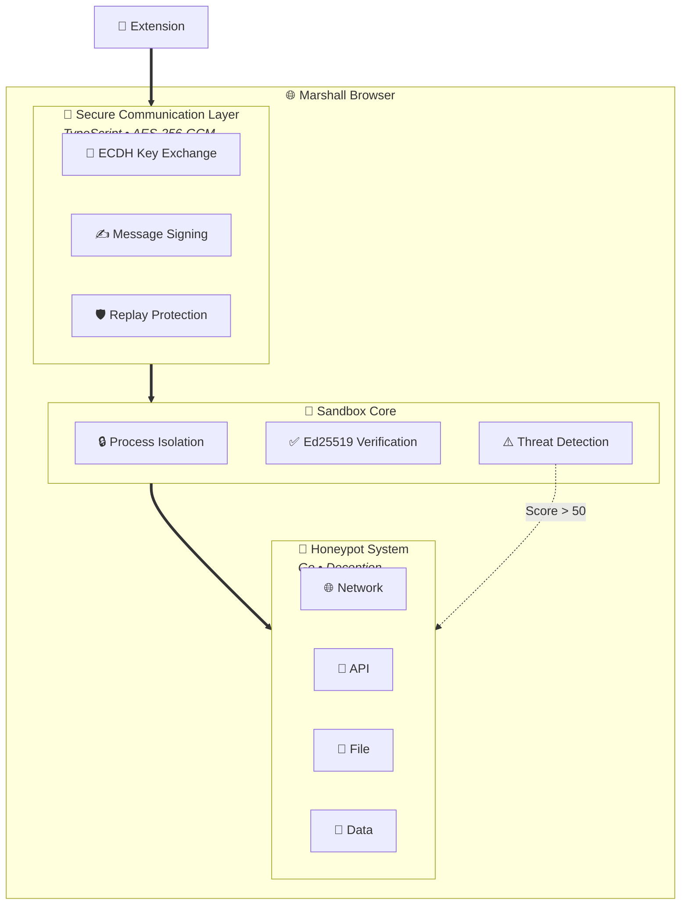

<div align="center">

# 🔌 Marshall Extensions

### Security & OSINT Extensions for Marshall Browser

[](LICENSE)
[](https://github.com/bad-antics/marshall)
[](https://www.rust-lang.org/)
[](https://go.dev/)
[](https://www.typescriptlang.org/)

<br/>

**A curated collection of security-focused browser extensions with multi-layered sandbox isolation and honeypot detection.**

[Extensions](#-available-extensions) • [Installation](#-installation) • [Sandbox](#-sandbox-architecture) • [Development](#️-extension-development) • [Documentation](#-documentation)

</div>

---

## 🎯 Overview

Marshall Extensions provides a growing ecosystem of **security and OSINT tools** that integrate directly into the [Marshall Browser](https://github.com/bad-antics/marshall). Every extension runs inside a **hardened sandbox** with:

- 🔐 **AES-256-GCM encrypted communication**
- 🦀 **Rust-based process isolation** (seccomp-bpf, namespaces)
- 🍯 **Go honeypot system** for detecting malicious behavior
- 📊 **Behavioral threat scoring** with automatic containment

---

## 📦 Available Extensions

### 🔍 Reconnaissance

| Extension | Description | Language |
|-----------|-------------|----------|
| **Shodan Lookup** | Query Shodan.io for IP/domain intelligence, open ports, vulnerabilities | JavaScript |
| **WHOIS Inspector** | Detailed domain registration info, registrar history, name servers | JavaScript |
| **DNS Analyzer** | DNS record enumeration, zone transfers, subdomain discovery | JavaScript |
| **Wayback Machine** | View historical snapshots of any webpage | JavaScript |

### ⚡ Vulnerability Assessment

| Extension | Description | Language |
|-----------|-------------|----------|
| **XSS Scanner** | Detect reflected, stored, and DOM-based XSS vulnerabilities | JavaScript |
| **Header Analyzer** | Security header analysis (CSP, HSTS, X-Frame-Options) with recommendations | JavaScript |
| **Cert Inspector** | SSL/TLS certificate analysis, chain validation, grading | Ruby |
| **SQLi Detector** | SQL injection point detection and payload testing | JavaScript |

### 📡 Network Analysis

| Extension | Description | Language |
|-----------|-------------|----------|
| **Traffic Analyzer** | Real-time network monitoring, anomaly detection, traffic patterns | TypeScript |
| **Request Tamper** | HTTP interception, modification, replay attacks | Lua |
| **WebSocket Inspector** | Monitor and modify WebSocket connections | TypeScript |
| **Cookie Manager** | Advanced cookie analysis, modification, and export | JavaScript |

### 🧠 Forensics

| Extension | Description | Language |
|-----------|-------------|----------|
| **Memory Forensics** | Memory artifact detection, shellcode patterns, process injection | C |
| **JS Deobfuscator** | Unpack and analyze obfuscated JavaScript | JavaScript |
| **Metadata Extractor** | Extract EXIF, document metadata from files | Python |

### ��️ Utilities

| Extension | Description | Language |
|-----------|-------------|----------|
| **Request Logger** | Log and export all HTTP requests/responses | JavaScript |
| **Response Beautifier** | Format JSON, XML, HTML responses | JavaScript |
| **Hash Calculator** | MD5, SHA-1, SHA-256, SHA-512 hash generation | JavaScript |
| **Encoder/Decoder** | Base64, URL, HTML entity encoding/decoding | JavaScript |
| **Screenshot Tool** | Full page and element screenshots | JavaScript |

---

## 🚀 Installation

### Method 1: Marshall Extension Manager (Recommended)

1. Open **Marshall Browser**
2. Navigate to `Settings → Extensions`
3. Click **"Browse Repository"**
4. Select extensions to install
5. Grant required permissions

### Method 2: Manual Installation

```bash
# Clone the repository
git clone https://github.com/bad-antics/marshall-extensions.git

# Copy extension to Marshall extensions directory
cp -r marshall-extensions/extensions/recon/shodan-lookup ~/.marshall/extensions/

# Restart Marshall Browser
marshall --reload-extensions
```

### Method 3: Install from URL

```bash
# Install directly from GitHub
marshall --install-extension https://github.com/bad-antics/marshall-extensions/releases/download/v1.0.0/shodan-lookup.mext
```

---

## 🔒 Sandbox Architecture

All extensions execute in a **multi-layered security sandbox** that isolates untrusted code and detects malicious behavior.


```mermaid
flowchart TB
    subgraph Browser["🌐 Marshall Browser"]
        subgraph CommLayer["📡 Secure Communication Layer<br/><i>TypeScript • AES-256-GCM</i>"]
            ECDH["🔑 ECDH Key Exchange"]
            Sign["✍️ Message Signing"]
            Replay["🛡️ Replay Protection"]
        end
        
        subgraph SandboxCore["🦀 Sandbox Core<br/><i>Rust • libseccomp</i>"]
            Isolation["🔒 Process Isolation"]
            Verify["✅ Ed25519 Verification"]
            Threat["⚠️ Threat Detection"]
        end
        
        subgraph Honeypot["🍯 Honeypot System<br/><i>Go • Deception</i>"]
            NetHP["🌐 Network"]
            ApiHP["🔌 API"]
            FileHP["📁 File"]
            DataHP["🔑 Data"]
        end
    end
    
    Ext["🧩 Extension"] ==> CommLayer
    CommLayer ==> SandboxCore
    SandboxCore ==> Honeypot
    Threat -.->|"Score > 50"| Honeypot
```

### Security Layers

| Layer | Component | Technology | Purpose |
|-------|-----------|------------|---------|
| **1** | Communication | TypeScript | AES-256-GCM encryption, ECDH key exchange |
| **2** | Sandbox Core | Rust | seccomp-bpf syscall filtering, namespace isolation |
| **3** | Honeypot | Go | Fake services, credential honeytokens, intrusion detection |

### Threat Detection

The sandbox monitors all extension behavior and assigns threat scores:

| Indicator | Score | Action |
|-----------|-------|--------|
| Blocked API call | +10 | Log warning |
| Excessive network requests | +5 | Rate limit |
| Unauthorized file access | +15 | Deny + alert |
| Credential harvesting attempt | +25 | Honeypot redirect |
| Process/memory scanning | +20 | Terminate |
| **Score > 50** | — | **Full honeypot containment** |

### Permission System

Extensions must declare required permissions in their manifest:

```json
{
  "permissions": [
    "activeTab",      // Access current tab
    "network",        // Make HTTP requests
    "storage",        // Persistent storage
    "dom",            // Page DOM access
    "clipboard",      // Clipboard access
    "notifications"   // System notifications
  ]
}
```

---

## 🛠️ Extension Development

### Quick Start

```bash
# Create new extension from template
marshall-cli create-extension my-extension

# Structure created:
my-extension/
├── manifest.json    # Extension metadata
├── main.js          # Entry point
├── icon.png         # 128x128 icon
└── README.md        # Documentation
```

### Manifest Schema

```json
{
  "name": "My Extension",
  "version": "1.0.0",
  "description": "What this extension does",
  "author": "your-username",
  "homepage": "https://github.com/your-username/my-extension",
  "permissions": ["activeTab", "network"],
  "main": "main.js",
  "icon": "icon.png",
  "category": "recon",
  "marshall_version": ">=1.0.0"
}
```

### Marshall Extension API

```javascript
// Get current tab info
const tab = await marshall.tabs.getCurrent();
console.log(tab.url, tab.title);

// Make network request (sandboxed)
const response = await marshall.network.fetch('https://api.example.com/data', {
  method: 'GET',
  headers: { 'X-API-Key': apiKey }
});
const data = await response.json();

// Store data persistently
await marshall.storage.set('lastResult', data);
const stored = await marshall.storage.get('lastResult');

// Show UI panel
marshall.ui.showPanel(`
  <div class="result">
    <h2>Results</h2>
    <pre>${JSON.stringify(data, null, 2)}</pre>
  </div>
`);

// Send notification
marshall.ui.notify('Scan complete!', 'success');

// Access page DOM (requires 'dom' permission)
const pageContent = await marshall.dom.evaluate(() => {
  return document.body.innerHTML;
});
```

### Categories

| Category | Description |
|----------|-------------|
| `recon` | Reconnaissance & OSINT |
| `vuln` | Vulnerability assessment |
| `network` | Network analysis |
| `forensics` | Digital forensics |
| `utility` | General utilities |

---

## 📁 Project Structure

```
marshall-extensions/
├── sandbox/                      # Security sandbox system
│   ├── core/                     # Rust sandbox runtime
│   │   ├── src/
│   │   │   ├── lib.rs            # Sandbox entry point
│   │   │   ├── isolation.rs      # Process isolation (seccomp, namespaces)
│   │   │   ├── verification.rs   # Ed25519 signature verification
│   │   │   ├── permissions.rs    # Permission enforcement
│   │   │   └── threat.rs         # Threat scoring engine
│   │   └── Cargo.toml
│   ├── honeypot/                 # Go deception system
│   │   ├── main.go               # Honeypot services
│   │   ├── network.go            # Fake network services
│   │   ├── api.go                # Fake API endpoints
│   │   └── go.mod
│   └── comm/                     # TypeScript secure channel
│       ├── channel.ts            # Encrypted IPC
│       ├── crypto.ts             # AES-256-GCM, ECDH
│       └── package.json
├── extensions/
│   ├── recon/                    # Reconnaissance extensions
│   │   ├── shodan-lookup/
│   │   ├── whois-inspector/
│   │   └── dns-analyzer/
│   ├── vuln/                     # Vulnerability extensions
│   │   ├── xss-scanner/
│   │   ├── header-analyzer/
│   │   └── cert-inspector/       # Ruby
│   ├── network/                  # Network extensions
│   │   ├── traffic-analyzer/     # TypeScript
│   │   └── request-tamper/       # Lua
│   ├── forensics/                # Forensics extensions
│   │   └── memory-forensics/     # C
│   └── utility/                  # Utility extensions
├── lib/                          # Shared libraries
│   ├── marshall-api.js           # Extension API
│   └── common-utils.js           # Utilities
├── docs/                         # Documentation
│   ├── Home.md
│   ├── Sandbox-Architecture.md
│   └── Extension-Development.md
└── README.md
```

---

## 📖 Documentation

| Document | Description |
|----------|-------------|
| [Sandbox Architecture](docs/Sandbox-Architecture.md) | Deep dive into the security sandbox |
| [Extension Development](docs/Extension-Development.md) | Complete API reference and guides |
| [Contributing](CONTRIBUTING.md) | How to contribute extensions |

---

## ⚠️ Disclaimer

These extensions are provided for **educational and authorized security testing purposes only**. 

- ✅ Use on systems you own or have explicit permission to test
- ❌ Do not use for unauthorized access or malicious purposes
- 📜 Follow all applicable laws and regulations

---

## 🤝 Contributing

We welcome contributions! Here's how to submit a new extension:

1. Fork this repository
2. Create your extension in `extensions/<category>/`
3. Include `manifest.json`, `main.js`, `icon.png`, and `README.md`
4. Test with `marshall --test-extension ./your-extension`
5. Submit a pull request

See [CONTRIBUTING.md](CONTRIBUTING.md) for detailed guidelines.

---

## 📄 License

MIT License — See [LICENSE](LICENSE) for details.

---

## 🔗 Related Projects

| Project | Description |
|---------|-------------|
| [Marshall Browser](https://github.com/bad-antics/marshall) | The privacy-focused browser |
| [NullSec Tools](https://github.com/bad-antics/nullsec-tools) | Comprehensive security toolkit |
| [NullSec Linux](https://nullsec.pages.dev) | Security-focused Linux distribution |

---

<div align="center">

**Part of the NullSec Security Suite**

Built by [bad-antics](https://github.com/bad-antics)

[](https://x.com/AnonAntics)
[](https://bad-antics.github.io)

</div>
